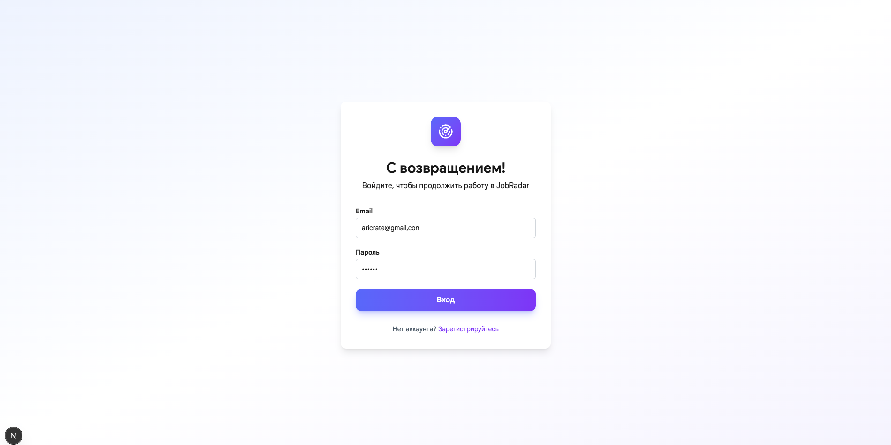
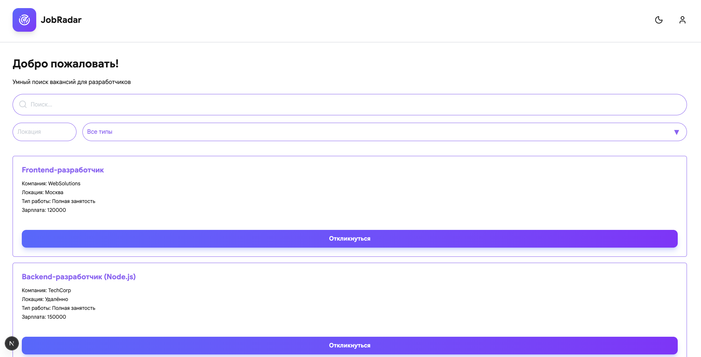
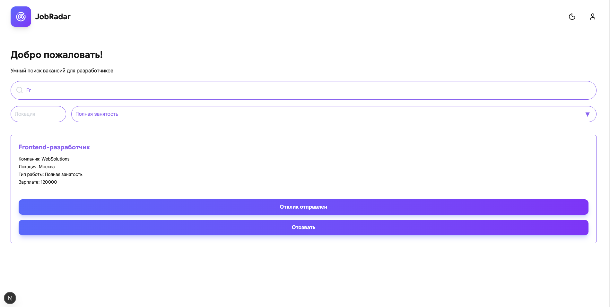
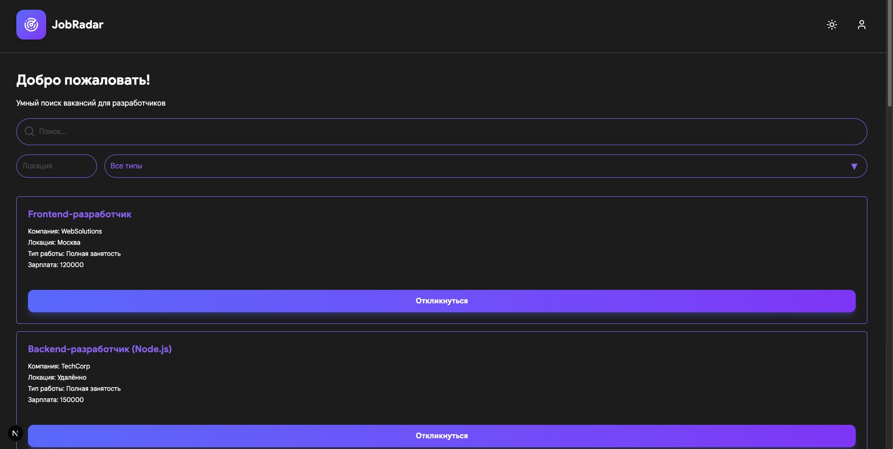
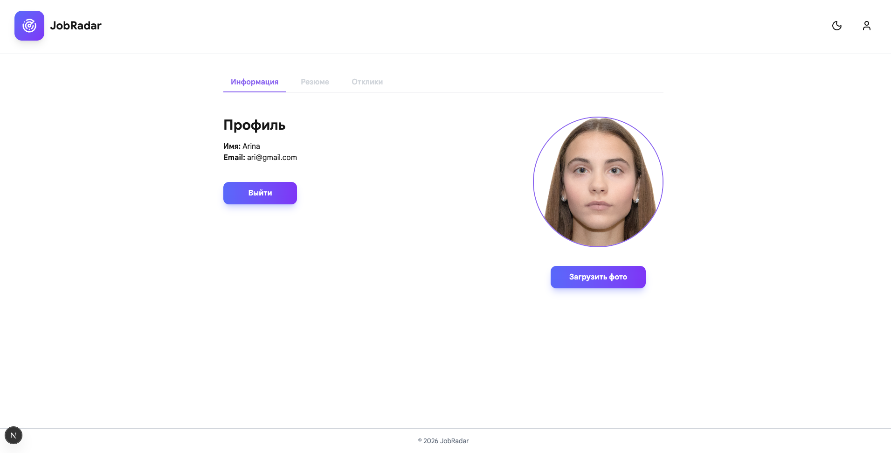
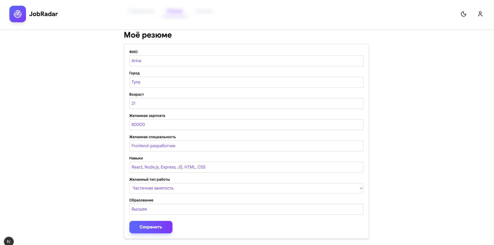
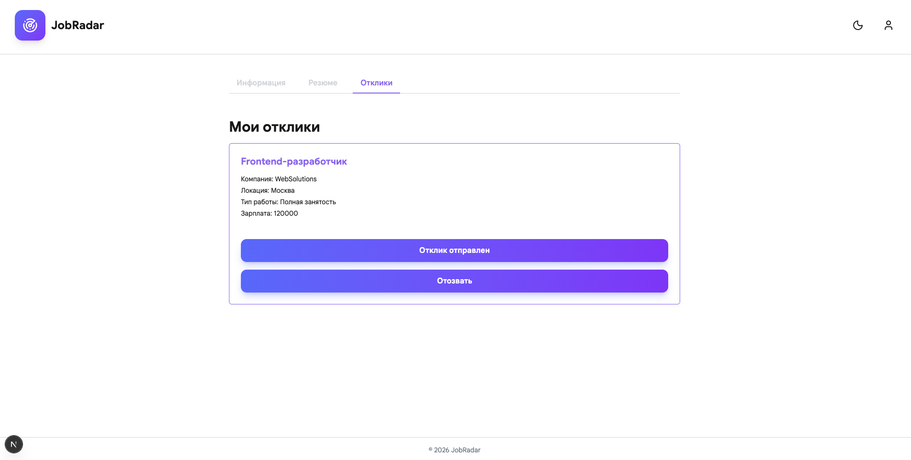
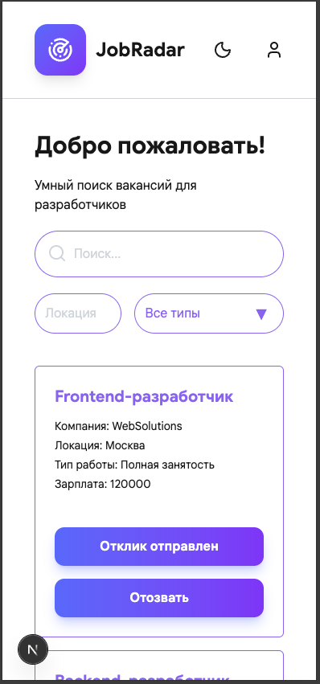

# JobRadar 🚀

**JobRadar** — это современное веб-приложение для поиска работы и управления резюме.  
Приложение позволяет искать вакансии, откликаться на них, хранить своё резюме и отслеживать отклики на вакансии. Всё сделано с использованием **Next.js**, **TypeScript**, **Tailwind CSS**, и архитектуры FSD.

---

## 📝 Основные возможности

- Создание и редактирование профиля пользователя.
- Заполнение и хранение резюме с возможностью указания:
  - ФИО
  - Город
  - Возраст
  - Желаемая зарплата
  - Желаемая специальность
  - Навыки
  - Тип работы
  - Образование
- Поиск вакансий с фильтрами по:
  - Локации
  - Типу работы (полная занятость, частичная занятость, фриланс)
- Отклик на вакансии и просмотр всех своих откликов.
- Адаптивный интерфейс для всех устройств.
- Сохранение данных на сервере с использованием REST API.
- Система аутентификации пользователей
- Возможность переключения темной и светлой темы интерфейса

---

## ⚡ Технологии

- [Next.js 13](https://nextjs.org/) — фронтенд и серверный рендеринг.
- [TypeScript](https://www.typescriptlang.org/) — статическая типизация.
- [Tailwind CSS](https://tailwindcss.com/) — стилизация компонентов.
- [React Redux](https://redux.js.org/) — управление состоянием.
- [Node.js + Express](https://expressjs.com/) — серверная часть и REST API.
- [JSON files] — хранение данных пользователей и откликов.

---

## 🚀 Запуск проекта локально

1. Клонируем репозиторий:

```bash
git clone git@github.com:arinakalmykova/JobRadar.git
cd JobRadar
````

2. Устанавливаем зависимости:

```bash
npm install
```

3. Создаём `.env` файл и добавляем необходимые переменные (пример):

```env
DATABASE_URL=...
NEXT_PUBLIC_API_URL=http://localhost:5001
```

4. Запускаем проект:

```bash
npm run dev
```

5. Открываем в браузере:

```
http://localhost:3000
```

---

## 📂 Структура проекта (FSD)

```
app/                - страницы и маршруты Next.js
entities/           - сущности (типизация, API, модели)
features/           - кастомные хуки и бизнес-логика
widgets/            - переиспользуемые UI-компоненты
shared/             - общие компоненты и UI элементы
server/             - json-файлы с данными, роуты и изображения аватара
```

---

## 👩‍💻 Как пользоваться

1. Зарегистрируйтесь или войдите в систему.
2. Заполните профиль и резюме.
3. На главной странице ищите вакансии по ключевым словам.
4. Фильтруйте вакансии по типу работы и локации.
5. Нажимайте **“Откликнуться”**, чтобы добавить вакансию в свои отклики.
6. В профиле вы можете просмотреть все свои отклики и изменить резюме.

---

## ✨ Планы на будущее

* Поддержка загрузки файлов резюме в PDF.
* Система уведомлений о новых вакансиях.
* Интеграция с внешними API вакансий.
* Улучшение UX и мобильной версии.

--- 

## Результат


---

---

---

---

---

---

---


